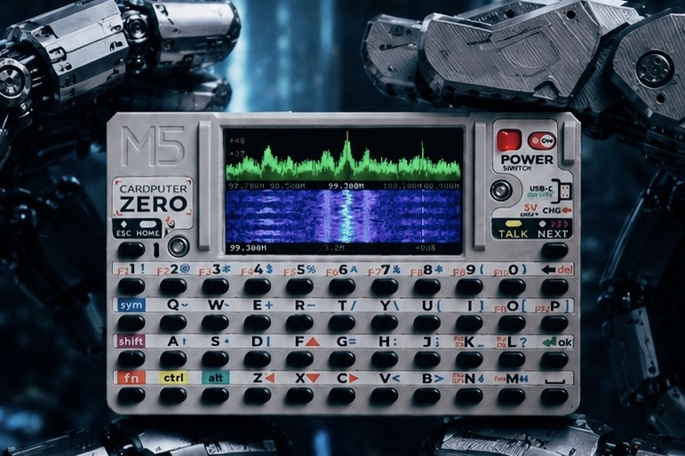

# zeroSDR

[](https://www.gnu.org/licenses/gpl-3.0)
[]()

zeroSDR is an open source SDR receiver for Linux-based small screen embedded systems.



## Features

- Real-time spectrum and waterfall visualization
- Audio demodulation (FM/NFM/AM) with ALSA output
- Direct framebuffer rendering for minimal overhead
- Optimized for Raspberry Pi Zero 2W and Pi 5
- Designed for M5Stack Cardputer Zero (320x170 display)

## Hardware Requirements

- Raspberry Pi 5 or Pi Zero 2W
- **RTL-SDR dongle** (tested: RTL-SDR Blog V4, RTL2832U SDR)
- 320x170 SPI display on `/dev/fb0`
- **Latest rtl-sdr drivers** (critical for correct frequency tuning)

## Quick Start

### Install Dependencies

```bash
sudo apt-get update
sudo apt-get install -y build-essential cmake librtlsdr-dev libasound2-dev
```

### Build

```bash
mkdir build && cd build
cmake ..
make -j$(nproc)
sudo make install
```

### Run

```bash
zerosdr                    # Start with defaults
zerosdr -f 100000000       # Tune to 100 MHz (FM broadcast)
zerosdr -f 118000000       # Tune to 118 MHz (aviation AM)
zerosdr -s 2048000 -g 20   # Custom sample rate and gain
```

## Keyboard Controls

### Frequency Tuning
| Key | Action |
|-----|--------|
| `←` `→` | Tune ±100 kHz (hold for acceleration) |
| `Shift+←` `Shift+→` | Tune ±1 MHz (hold for acceleration) |
| `0-9` `.` | Direct frequency input (MHz) |
| `Enter` | Confirm frequency input |
| `Backspace` | Delete last digit |
| `Esc` | Cancel frequency input |

### Display Control
| Key | Action |
|-----|--------|
| `Shift+Z` | Cycle display zoom (3.2M → 2.8M → ... → 50k) |
| `Shift+R` | Cycle FFT resolution (256/512/1024/2048) |
| `M` | Cycle display mode (spectrum+waterfall / spectrum / waterfall) |
| `Shift+S` | Take screenshot (saved to ~/zerosdr_*.png) |

### Audio & Demodulation
| Key | Action |
|-----|--------|
| `D` | Cycle demodulation mode (FM → NFM → AM) |
| `Shift+B` | Cycle demodulation bandwidth |
| `Space` | Toggle audio on/off |
| `V` / `C` | Volume up / down |
| `S` | Adjust squelch (+5% per press) |
| `S` (long press) | Reset squelch to 0% |
| `A` | Toggle audio AGC on/off |

### Gain Control
| Key | Action |
|-----|--------|
| `G` | Toggle hardware AGC on/off |
| `↑` / `↓` | Manual gain ±1 dB (when AGC off) |

### Other
| Key | Action |
|-----|--------|
| `+` / `-` | Cycle sample rate (1.024/1.2/1.8/2.048/2.4 MHz) |
| `Q` / `Esc` | Quit |

## Demodulation Bandwidth Presets

### FM (Wideband FM Broadcast)
- 200 kHz: Narrow (crowded bands)
- 250 kHz: Standard stereo
- **300 kHz: Default** (full stereo + RDS)
- 400 kHz: Wide (strong signals)
- 500 kHz: Maximum (best quality)

### NFM (Narrowband FM Communications)
- 6.25 kHz: Ultra-narrow
- **12.5 kHz: Default** (standard NFM)
- 25 kHz: Wide NFM

### AM (Amplitude Modulation)
- 5 kHz: Narrow
- **10 kHz: Default** (standard AM)
- 15 kHz: Wide

## Display Zoom Levels

Press `Shift+Z`  through zoom levels (from wide to narrow):
- 3.2 MHz: Full spectrum view
- 2.8 MHz / 2 MHz: Wide view
- 1 MHz / 500 kHz: Medium zoom
- 200 kHz / 100 kHz: Narrow zoom
- 50 kHz: Ultra-narrow (maximum resolution)

## Command Line Options

```
Usage: zerosd -k <device>   Set keyboard input device (default: auto-detect)
  -h            Show help
```

## Troubleshooting

### Frequency Offset Issues
If the displayed spectrum doesn't match the actual frequency:
- **Update rtl-sdr drivers to the latest version** (most common cause)
- Check PPM correction with `rtl_test`

### RTL-SDR Not Detected
```bash
lsusb | grep RTL    # Verify device is connectedlity
```

### Permission Denied on /dev/fb0
```bash
sudo usermod -a -G video $USER
# Log out and back in
```

### No Audio Output
```bash
aplay -l            # List audio devices
alsamixer           # Check volume levels
```

## Cross-Compilation for Pi Zero 2W

```bash
# Install toolchain
sudo apt-get install -y gcc-aarch64-linux-gnu g++-aarch64-linux-gnu

# Build
mkdir build-zero2w && cd build-zero2w
cmake .. \
  -DCMAKE_SYSTEM_NAME=Linux \
  -DCMAKE_SYSTEM_PROCESSOR=aarch64 \
  -DCMAKE_C_COMPILER=aarch64-linux-gnu-gcc \
  -DCMAKE_CXX_COMPILER=aarch64-linux-gnu-g++
make -j$(nproc)

# Copy to device
scp zerosdr pi@cardputer-zero.local:/home/pi/
```

## License

This project is licensed under the GNU General Public License v3.0 - see the [LICENSE](LICENSE) file for det Feng**
- Email: bestedwin@gmail.com

## Acknowledgments

- Built with [rtl-sdr](https://github.com/osmocom/rtl-sdr) library
- Designed for M5Stack Cardputer Zero
